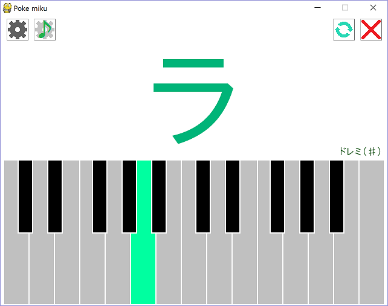

Pokemiku.py
=========

ポケットミクが音階を歌うPythonスクリプト

## 概要

ポケットミクが音階を歌うPythonスクリプト（プログラム）です。
ポケットミクとゲームパッド/MIDIキーボードを接続したPCで実行することができます。

[Raspberry Pi内臓ポケミク](http://mashigure.blog.jp/archives/9299520.html)で実行しているものと同じですので、
どのようなものかはそちらも参考にしてください。

## 必要機器

* [ポケットミク](http://www.otonanokagaku.net/nsx39/)、
[eVY1シールド](https://www.switch-science.com/catalog/1490/)
 または 
[eVY1ボード](https://www.switch-science.com/catalog/1489/)

* ゲームパッドまたはMIDIキーボード（両方同時に使用可能）

※ 使用するゲームパッドは
[Buffalo製レトロ調USBゲームパッド](http://buffalo.jp/product/input/gamepad/bsgp801/)を
想定していますが、その他のゲームパッドでも問題なく動作します。（たぶん）

※ MIDIキーボード使用の際は、ソースコード41行目のリストに使用するキーボード名を追加して下さい。

## 動作環境

下記がインストールされ、動作可能なPC上

* Python 2.4
* Pygame

### 確認済み環境
Ubuntsu 16.04, Windows 10 Home および Rasbian Jessie(2016/03/25)　上にて動作を確認

## 実行方法

### 準備
* Pokemiku.pyをダウンロードし、任意のフォルダに保存して下さい。
* Pokemiku.pyを保存したフォルダに、[IPAフォント Pゴシック](http://forest.watch.impress.co.jp/library/software/ipafont/)をダウンロードして保存して下さい。

### 実行
* Pokemiku.pyを実行して下さい。

## 操作方法

### ゲームパッド：演奏操作

* 十字キー（ジョイスティック） ↓： ド 
* 十字キー（ジョイスティック） ←： レ
* 十字キー（ジョイスティック） ↑： ミ
* 十字キー（ジョイスティック） →： ファ
* ボタン3(Y)：ソ
* ボタン1(B)：ラ
* ボタン0(A)：シ
* ボタン2(X)：ド
* ボタン4(L)：押している間半音上がる
* ボタン5(R)：押している間１オクターブ上がる

### ゲームパッド：演奏以外のボタン操作

* ボタン7(START): ボーカロイド（歌唱） のOn/Off切り替え
* ボタン4(L)を押しながらボタン6(SELECT)： トランスポーズ-1（半音下げる）
* ボタン5(R)を押しながらボタン6(SELECT)： トランスポーズ+1（半音上げる）
* ボタン4(L)とボタン5(R)を押しながらボタン6(SELECT)： トランスポーズを元に戻す
* ボタン4(L)+ ボタン5(R) + ボタン6(SELECT) + ボタン7(START) 同時押し： ウィンドウを閉じる

### その他

エスケープキー： ウィンドウを閉じる

